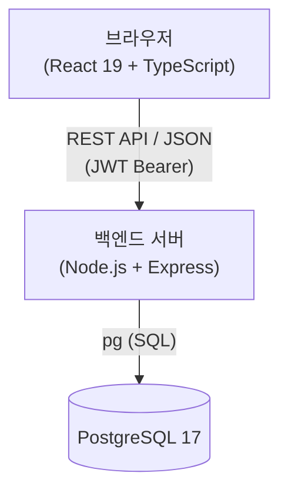
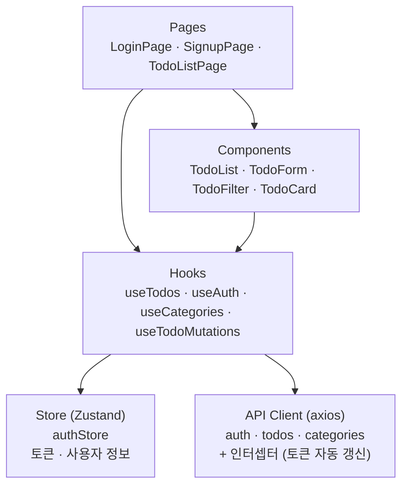
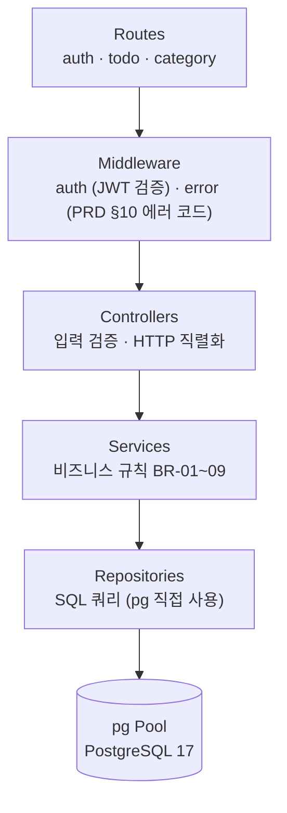
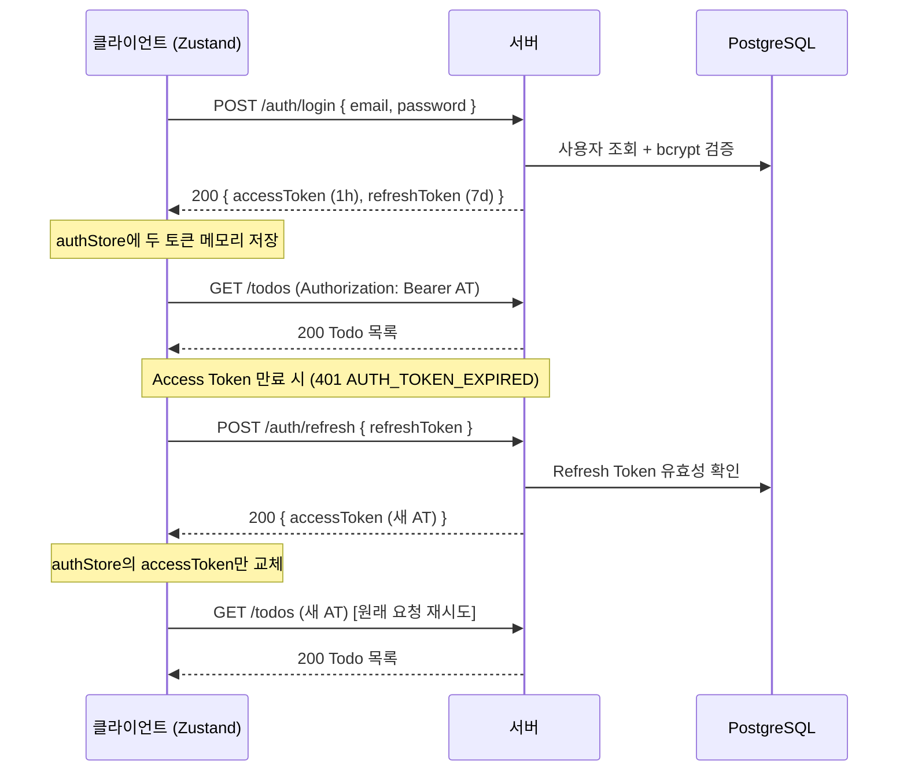
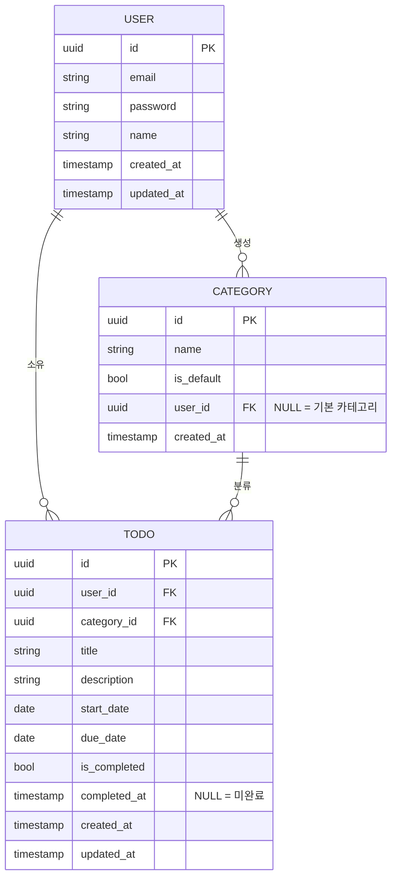
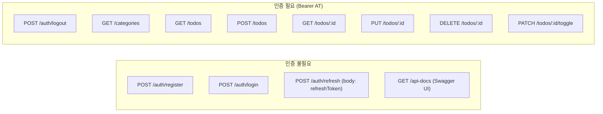

# TodoListApp 기술 아키텍처 다이어그램

Version 1.0 | 2026-05-13

---

## 1. 시스템 전체 구조

```mermaid
graph TD
    Browser["브라우저\n(React 19 + TypeScript)"]
    Server["백엔드 서버\n(Node.js + Express)"]
    DB[("PostgreSQL 17")]

    Browser -- "REST API / JSON\n(JWT Bearer)" --> Server
    Server -- "pg (SQL)" --> DB
```

---

## 2. 프론트엔드 레이어

```mermaid
graph TD
    Page["Pages\nLoginPage · SignupPage · TodoListPage"]
    Component["Components\nTodoList · TodoForm · TodoFilter · TodoCard"]
    Hook["Hooks\nuseTodos · useAuth · useCategories · useTodoMutations"]
    State["Store (Zustand)\nauthStore\n토큰 · 사용자 정보"]
    API["API Client (axios)\nauth · todos · categories\n+ 인터셉터 (토큰 자동 갱신)"]

    Page --> Component
    Page --> Hook
    Component --> Hook
    Hook --> State
    Hook --> API
```

---

## 3. 백엔드 레이어

```mermaid
graph TD
    Router["Routes\nauth · todo · category"]
    Middleware["Middleware\nauth (JWT 검증) · error (PRD §10 에러 코드)"]
    Controller["Controllers\n입력 검증 · HTTP 직렬화"]
    Service["Services\n비즈니스 규칙 BR-01~09"]
    Repository["Repositories\nSQL 쿼리 (pg 직접 사용)"]
    Pool[("pg Pool\nPostgreSQL 17")]

    Router --> Middleware
    Middleware --> Controller
    Controller --> Service
    Service --> Repository
    Repository --> Pool
```

---

## 4. 인증 흐름

```mermaid
sequenceDiagram
    participant C as 클라이언트 (Zustand)
    participant S as 서버
    participant DB as PostgreSQL

    C->>S: POST /auth/login { email, password }
    S->>DB: 사용자 조회 + bcrypt 검증
    S-->>C: 200 { accessToken (1h), refreshToken (7d) }
    Note over C: authStore에 두 토큰 메모리 저장

    C->>S: GET /todos (Authorization: Bearer AT)
    S-->>C: 200 Todo 목록

    Note over C,S: Access Token 만료 시 (401 AUTH_TOKEN_EXPIRED)
    C->>S: POST /auth/refresh { refreshToken }
    S->>DB: Refresh Token 유효성 확인
    S-->>C: 200 { accessToken (새 AT) }
    Note over C: authStore의 accessToken만 교체
    C->>S: GET /todos (새 AT) [원래 요청 재시도]
    S-->>C: 200 Todo 목록
```

---

## 5. 데이터 모델

```mermaid
erDiagram
    USER {
        uuid id PK
        string email
        string password
        string name
        timestamp created_at
        timestamp updated_at
    }
    CATEGORY {
        uuid id PK
        string name
        bool is_default
        uuid user_id FK "NULL = 기본 카테고리"
        timestamp created_at
    }
    TODO {
        uuid id PK
        uuid user_id FK
        uuid category_id FK
        string title
        string description
        date start_date
        date due_date
        bool is_completed
        timestamp completed_at "NULL = 미완료"
        timestamp created_at
        timestamp updated_at
    }

    USER ||--o{ TODO : "소유"
    USER ||--o{ CATEGORY : "생성"
    CATEGORY ||--o{ TODO : "분류"
```

---

## 6. 주요 API 엔드포인트

```mermaid
graph LR
    subgraph Auth ["인증 불필요"]
        A1["POST /auth/register"]
        A2["POST /auth/login"]
        A3["POST /auth/refresh (body: refreshToken)"]
        Z1["GET /api-docs (Swagger UI)"]
    end
    subgraph AuthReq ["인증 필요 (Bearer AT)"]
        B1["POST /auth/logout"]
        C1["GET /categories"]
        D1["GET /todos"]
        D2["POST /todos"]
        D3["GET /todos/:id"]
        D4["PUT /todos/:id"]
        D5["DELETE /todos/:id"]
        D6["PATCH /todos/:id/toggle"]
    end
```
