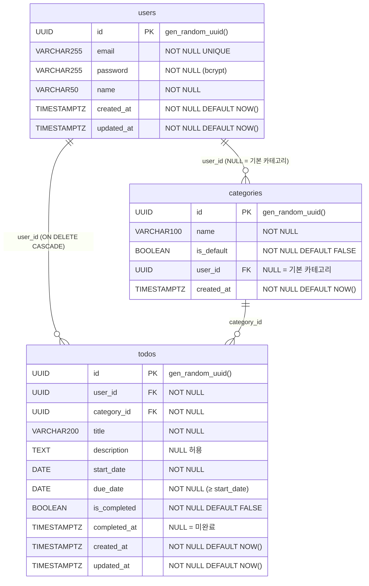

# TodoListApp ERD

Version 1.0 | 2026-05-13  
기반 문서: `1-domain-definition.md`, `2-prd.md`

---



---

## 관계 설명

| 관계 | 카디널리티 | 설명 |
|------|-----------|------|
| users → todos | 1:N | 사용자는 여러 할일을 소유. 사용자 삭제 시 할일 CASCADE 삭제 (BR-03) |
| users → categories | 1:N | 사용자 정의 카테고리 소유. `user_id = NULL`이면 기본 카테고리 (BR-05) |
| categories → todos | 1:N | 할일은 반드시 하나의 카테고리에 속함 (BR-07). 카테고리 삭제 시 연관 할일이 있으면 삭제 차단 (`CATEGORY_IN_USE`) |

---

## 주요 제약 조건

| 테이블 | 제약 | 내용 |
|--------|------|------|
| users | UNIQUE | `email` |
| categories | Nullable FK | `user_id` — NULL이면 기본 카테고리, 값이 있으면 사용자 정의 카테고리 |
| todos | CHECK | `due_date >= start_date` (BR-08) |
| todos | NOT NULL FK | `user_id`, `category_id` 모두 필수 |
| todos | Nullable | `completed_at` — 완료 토글 시 `NOW()` 기록, 미완료 복원 시 `NULL` (BR-09) |

---

## 인덱스

```sql
-- 할일 조회 성능 (사용자별 + 필터)
CREATE INDEX idx_todos_user_id      ON todos(user_id);
CREATE INDEX idx_todos_category_id  ON todos(category_id);
CREATE INDEX idx_todos_due_date     ON todos(due_date);
CREATE INDEX idx_todos_is_completed ON todos(is_completed);

-- 카테고리 조회 (기본 + 사용자 소유)
CREATE INDEX idx_categories_user_id ON categories(user_id);
```

---

## 기본 카테고리 초기 데이터

```sql
INSERT INTO categories (name, is_default, user_id) VALUES
  ('업무', TRUE, NULL),
  ('개인', TRUE, NULL),
  ('건강', TRUE, NULL),
  ('쇼핑', TRUE, NULL);
```

`is_default = TRUE`, `user_id = NULL` — 별도 할당 없이 모든 사용자가 공유 조회 방식으로 접근 (BR-05)
