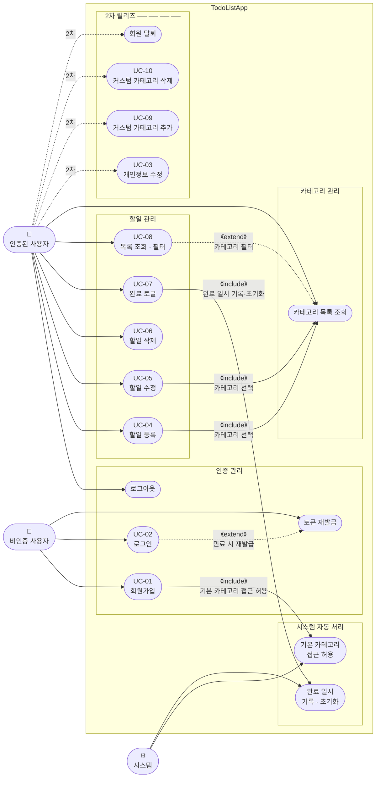

# TodoListApp Use Case Diagram

**버전:** 1.0  
**작성일:** 2026-05-13  
**기반 문서:** `docs/2-prd.md`

---

## 전체 유스케이스 다이어그램

---

## 액터 정의

| 액터 | 설명 |
|------|------|
| **비인증 사용자** | 회원가입·로그인·토큰 재발급만 접근 가능 |
| **인증된 사용자** | 로그인 후 할일·카테고리 모든 기능 사용 가능 |
| **시스템** | 사용자 행위에 따라 자동으로 실행되는 내부 처리 (카테고리 접근 허용, 완료 일시 기록) |

---

## 관계 정의

| 관계 | 대상 | 설명 |
|------|------|------|
| `《include》` | UC-01 → 기본 카테고리 접근 허용 | 회원가입 완료 시 반드시 실행 |
| `《include》` | UC-07 → 완료 일시 기록·초기화 | 완료 토글 시 `completed_at` 갱신 |
| `《include》` | UC-04, UC-05 → 카테고리 목록 조회 | 할일 등록·수정 시 카테고리 선택 필수 |
| `《extend》` | UC-08 → 카테고리 목록 조회 | 카테고리 필터 선택 시 조건부 실행 |
| `《extend》` | UC-02 → 토큰 재발급 | Access Token 만료 시 조건부 실행 |

---

## 1차 / 2차 구분

| 구분 | 유스케이스 |
|------|-----------|
| **1차 (MVP)** | UC-01 회원가입, UC-02 로그인, 로그아웃, 토큰 재발급, UC-04~08 할일 관리, 카테고리 목록 조회 |
| **2차** | UC-03 개인정보 수정, UC-09 커스텀 카테고리 추가, UC-10 커스텀 카테고리 삭제, 회원 탈퇴 |
